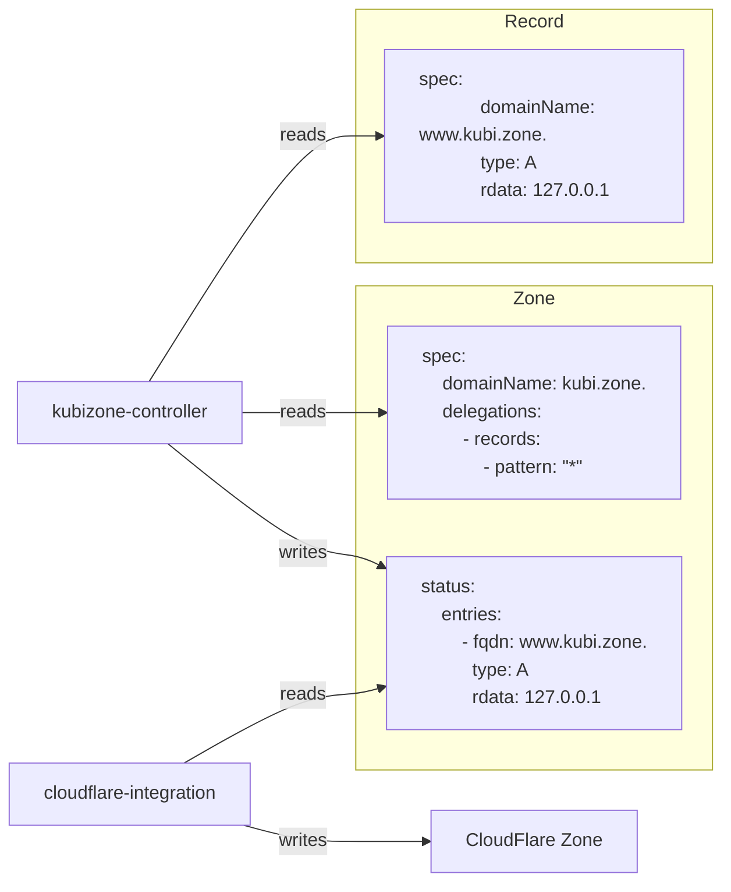
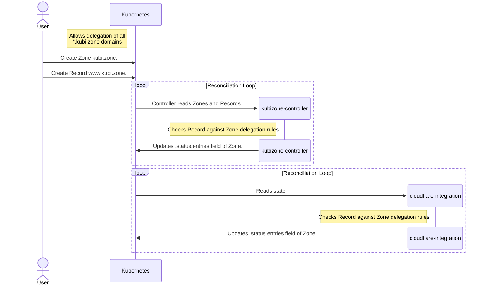

Kubernetes ecosystem of DNS resources and controllers.

The core of kubi.zone consists of the Kubernetes Custom Resources Record and Zone, as well as the kubizone controller, which manages their relations after creation.

See https://kubi.zone for in-depth information on deploying, running and using Kubizone

## Data Flow

The Kubizone controller keeps track of Records and Zones within the Kubernetes cluster, and uses this information to populate the `.status.entries` field of a Zone with the adopted records which have been vetted according to the delegations specified in the Zone.

Then, the provider-specific controller can use this populates `.status.entries` field to push DNS changes as it sees fit.

Here's a diagram showing how data is read and written for each of the respective controllers:

And here's a more in-depth sequence diagram:

